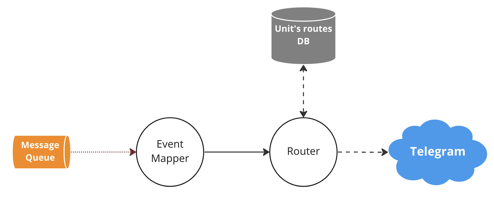

# ✈️ Notifications router

Сервис принимает сообщения по очереди задач и отправляет их через Telegram бота.

Так же отвечает за форматирование этих сообщений.

---

### 🎨 Схема проекта:



--- 

### ⚙️ Конфигурирование:

Создать `config.toml` в корне проекта на базе базового [`config.example.toml`](./config.example.ini).

- `telegram_bot_token` - токен Telegram бота.
- `database_api_url` - HTTP url сервиса [unit's routes](https://github.com/goretsky-integration/unit-routes-database).
- `rabbitmq_url` - url очереди задач.
- `debug` - режим отладки (`true`/`false`).
- `event_max_lifetime_in_seconds` - "срок годности" сообщения из очереди задач.

---

### 🚀 Запуск проекта:

Создание виртуального окружения.

```shell
poetry env use python3.10
```

Активация виртуального окружения.

```shell
poetry shell
```

Установка всех зависимостей.

```shell
poetry install --without dev
```

Запуск программы.

```shell
python3.10 src/main.py
```